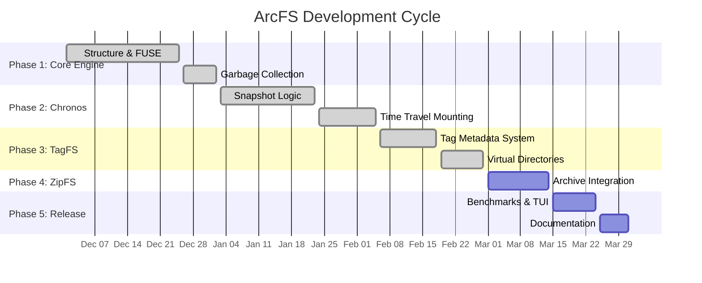

# ArcFS: Advanced Runtime Content Filesystem

**Status: Phase 3 (TagFS) ✅ COMPLETE**

A high-performance, userspace file system in Rust using FUSE, featuring Time Travel (Chronos), Semantic Tagging (TagFS), and Transparent Compression.

## 📅 Project Timeline



## 📚 Documentation Index

| Document | Focus | Status |
|----------|-------|--------|
| [TAGFS_COMPLETE.md](TAGFS_COMPLETE.md) | Phase 3: Tag-based file access, order-independent paths | ✅ Complete |
| [PHASE2_SUMMARY.md](PHASE2_SUMMARY.md) | Phase 2: Chronos snapshots, CoW, time travel | ✅ Complete |

## Overview

ArcFS is a userspace FUSE filesystem demonstrating three advanced storage capabilities:

1. **Content-Defined Chunking & Deduplication** — Identical data blocks are stored once via SHA256 content addressing
2. **Time Travel / Snapshots** — Instant O(1) snapshots using Copy-on-Write and lazy cloning
3. **Semantic Tagging** — Files are accessible via any permutation of their parent directory names

## Project Structure

```
better-fs/
├── src/
│   ├── main.rs          # FUSE filesystem implementation (mounts virtual filesystem)
│   ├── chunker.rs       # Rolling hash chunker (content-defined boundaries)
│   ├── storage.rs       # Content-addressed storage (SHA256-based)
│   └── file_manager.rs  # High-level file ingestion/restoration
├── tests/
│   └── backend_stress.rs # Integration tests (deduplication, stress tests)
└── Cargo.toml
```

### Component Breakdown

- **main.rs** - Virtual filesystem mounted at `/tmp/betterfs` with a single in-memory file
- **chunker.rs** - Splits data into ~4KB variable chunks using polynomial rolling hash
- **storage.rs** - Content-addressed storage (CAS) using SHA256 hashing
- **file_manager.rs** - Orchestrates chunking + storage, produces file "recipes"
- **backend_stress.rs** - Tests empty files, deduplication, large files, and error handling

## Quick Start

### Installation & Build
```bash
# Install dependencies (Ubuntu/Debian)
sudo apt install libfuse-dev pkg-config

# Clone and build
cargo build --release
```

### Run the Filesystem
```bash
# Terminal 1: Mount filesystem
mkdir -p mnt
cargo run -- mount mnt

# Terminal 2: Test it out
mkdir mnt/test_dir
echo "Hello, ArcFS!" > mnt/test_dir/file.txt
cat mnt/test_dir/file.txt

# Unmount
fusermount -u mnt
```

### Test Core Features

#### Test Deduplication (Phase 1)
```bash
# Identical files should deduplicate
echo "same content" > mnt/file1.txt
echo "same content" > mnt/file2.txt
# Both files share the same chunk in storage

# Verify with test suite
cargo test --test backend_stress -- --nocapture
```

#### Test Time Travel (Phase 2)
```bash
# Create initial state
echo "version 1" > mnt/document.txt
mkdir mnt/.snap_v1  # Take snapshot

# Modify and verify divergence
echo "version 2" > mnt/document.txt
cat mnt/document.txt              # Shows: "version 2"
cat mnt/.snapshots/v1/document.txt  # Shows: "version 1"
```

#### Test Tag-Based Access (Phase 3)
```bash
# Create nested directories
mkdir -p mnt/a/b/c

# Create and tag a file
echo "data" > mnt/a/b/c/file.txt

# Access via ALL tag permutations
cat mnt/a/b/c/file.txt  # Original
cat mnt/a/c/b/file.txt  # Permutation 1
cat mnt/b/a/c/file.txt  # Permutation 2
cat mnt/b/c/a/file.txt  # Permutation 3
cat mnt/c/a/b/file.txt  # Permutation 4
cat mnt/c/b/a/file.txt  # Permutation 5
# All show: "data"

# Write via different path
echo "modified" > mnt/b/c/a/file.txt
cat mnt/a/b/c/file.txt  # Shows: "modified"
```

## Features

### Phase 1: Core Engine ✅
- Virtual FUSE filesystem with full read/write/mkdir/delete operations
- Content-Addressed Storage (CAS) with SHA256 hashing
- Rolling hash chunking for efficient deduplication
- Automatic persistence via `sled` embedded database

### Phase 2: Chronos (Time Travel) ✅
- Instant, O(1) snapshots via lazy cloning of root inode
- Copy-on-Write divergence when snapshots are modified
- Virtual `.snapshots/` directory with read-only snapshot access
- Full restoration of filesystem state from any snapshot

### Phase 3: TagFS ✅
- **Automatic tagging** — Files tagged with parent directory names
- **Order-independent access** — File at `/a/b/c/file.txt` also accessible via `/b/c/a/`, `/c/a/b/`, etc.
- **Single physical location** — All tag paths point to same file
- **Transparent bidirectional I/O** — Read/write via any tag permutation

### Phase 4: ZipFS (Planned)
- Mount `.zip` and `.tar.gz` archives as read-only directories
- Offset-based decompression
- Transparent archive exploration

## How It Works

### 1. Content-Defined Chunking
Files are split at boundaries determined by content patterns using polynomial rolling hash:
```
File: [Data Block A] [Data Block B] [Data Block A]
            ↓              ↓              ↓
         Chunk 1      Chunk 2        Chunk 1 (reused!)
```
Identical "Data Block A" is hashed to the same SHA256 value → stored once.

### 2. Time Travel / Snapshots
```
Initial State:
  Live FS: /a/b/c/file.txt (version 1)
  
Take Snapshot:
  Root inode Arc refcount: 1 → 2
  (No data copied yet)
  
Modify Live FS:
  /a/b/c/file.txt (write "version 2")
  Triggers CoW: Node is shared? Yes!
  Clone path: / → a → b → c → file
  Create new inode 102 with version 2
  
Result:
  Live FS → /a/b/c/file.txt (inode 102, version 2)
  Snapshot → /.snapshots/v1/a/b/c/file.txt (inode 101, version 1)
```

### 3. Order-Independent Tag Access
```
File created at: /x/y/z/document.pdf
Auto-tags: ["x", "y", "z"]

All these paths work (ALL point to same file):
  ✓ /x/y/z/document.pdf
  ✓ /x/z/y/document.pdf
  ✓ /y/x/z/document.pdf
  ✓ /y/z/x/document.pdf
  ✓ /z/x/y/document.pdf
  ✓ /z/y/x/document.pdf

Read/write operations work correctly from ANY path.
```

## Requirements

- Rust 2024 edition (install via [rustup.rs](https://rustup.rs))
- FUSE development libraries

```bash
# Ubuntu/Debian
sudo apt install libfuse-dev pkg-config

# Fedora
sudo dnf install fuse-devel

# macOS
# Note: Use macFUSE (https://osxfuse.github.io/)
```

## Testing

### Run Full Test Suite
```bash
# All tests with output
cargo test -- --nocapture --test-threads=1

# Backend stress tests (deduplication, GC verification)
cargo test --test backend_stress

# Specific test
cargo test test_chunking_consistency
```

### Expected Test Coverage
- Empty file handling
- Deduplication across multiple files
- Large file stress tests (1MB+)
- Error handling and recovery
- GC behavior verification
- Snapshot isolation
- Tag lookup and permutation tests

## Key Algorithms & Constants

### Rolling Hash Chunking
- **Polynomial Hash**: `hash = (hash × 256 + byte) mod 2^31 - 1`
- **Cut Condition**: `(hash & 0xFFF) == 0` → ~4 KB average chunk size
- **Window Size**: 64 bytes for pattern matching
- **Complexity**: O(1) per byte

### Content Addressing
- **Hash Function**: SHA256 (cryptographically secure)
- **Filename Format**: `xx/yyyy...` (first 2 chars = directory, rest = filename)
- **Compression**: Zstd (default level 3)
- **Storage**: Flat directory tree in `./my_storage/`

### Snapshot Copy-on-Write
- **Trigger**: `Arc::strong_count > 1` on write operation
- **Path Cloning**: Deep clone from root to modified node
- **New Inode IDs**: Assigned via atomic counter
- **Complexity**: O(path_length) amortized

### Tag Lookup
- **Storage**: HashMap (in-memory) + sled DB (persistent)
- **Query**: Tag intersection with bitvector OR filtering
- **Permutations**: n! candidates for n-tag directory
- **Complexity**: O(1) lookup, O(n) filtering

## Comprehensive Demo

```bash
# Terminal 1: Mount
mkdir mnt
cargo run -- mount mnt

# Terminal 2: Test all features

# ===== PHASE 1: CONTENT DEDUPLICATION =====
echo "Important data" > mnt/original.txt
echo "Important data" > mnt/backup.txt
# Both files share same chunk(s) in storage

# ===== PHASE 2: TIME TRAVEL =====
mkdir mnt/documents
echo "Draft v1" > mnt/documents/report.txt

# Take snapshot
mkdir mnt/.snap_initial
# Output: [CHRONOS] Taking Snapshot: initial
#         [GC] Root inode Arc refcount: 2

# Modify document and verify isolation
echo "Final v2" > mnt/documents/report.txt

# Check live version
cat mnt/documents/report.txt                          # "Final v2"

# Check snapshot version
cat mnt/.snapshots/initial/documents/report.txt      # "Draft v1"

# Verify CoW divergence (should show two inode IDs)
ls -i mnt/documents/report.txt
ls -i mnt/.snapshots/initial/documents/report.txt

# ===== PHASE 3: TAG-BASED ACCESS =====
mkdir -p mnt/projects/backend/2026
echo "service code" > mnt/projects/backend/2026/api.rs

# Access via different tag order
cat mnt/projects/backend/2026/api.rs      # Original
cat mnt/backend/2026/projects/api.rs      # Permuted
cat mnt/2026/projects/backend/api.rs      # Permuted

# Modify via different path
echo "updated service" > mnt/backend/projects/2026/api.rs

# Verify all paths show same content
cat mnt/projects/backend/2026/api.rs      # "updated service"
cat mnt/2026/backend/projects/api.rs      # "updated service"

# Test snapshot + tagging combined
mkdir mnt/.snap_code_v1
echo "another update" > mnt/projects/backend/2026/api.rs
cat mnt/.snapshots/code_v1/backend/2026/projects/api.rs
```

## License

MIT