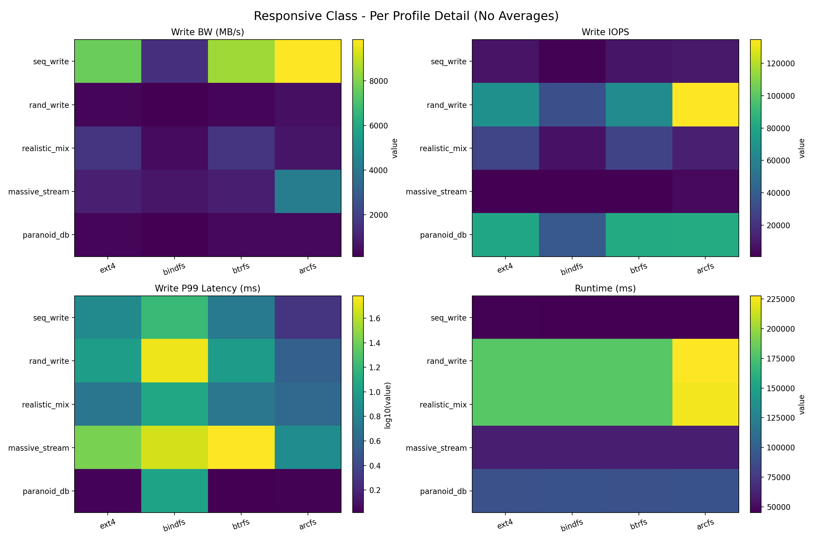
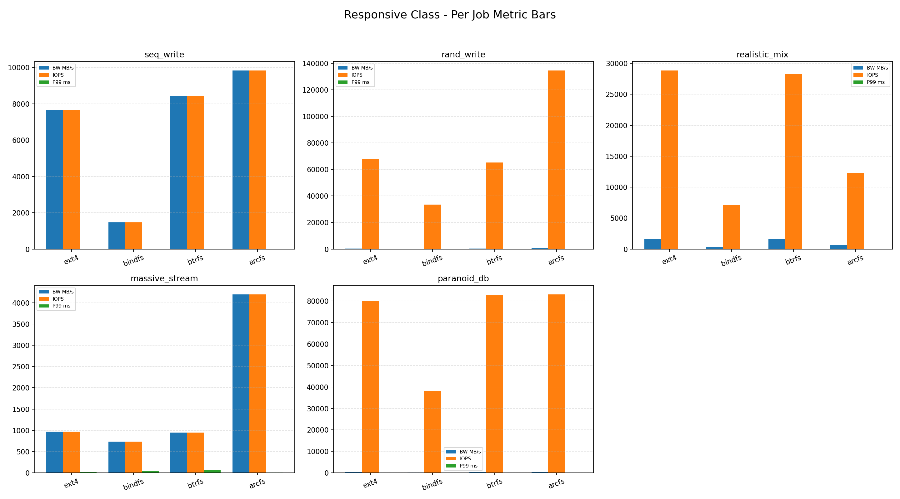
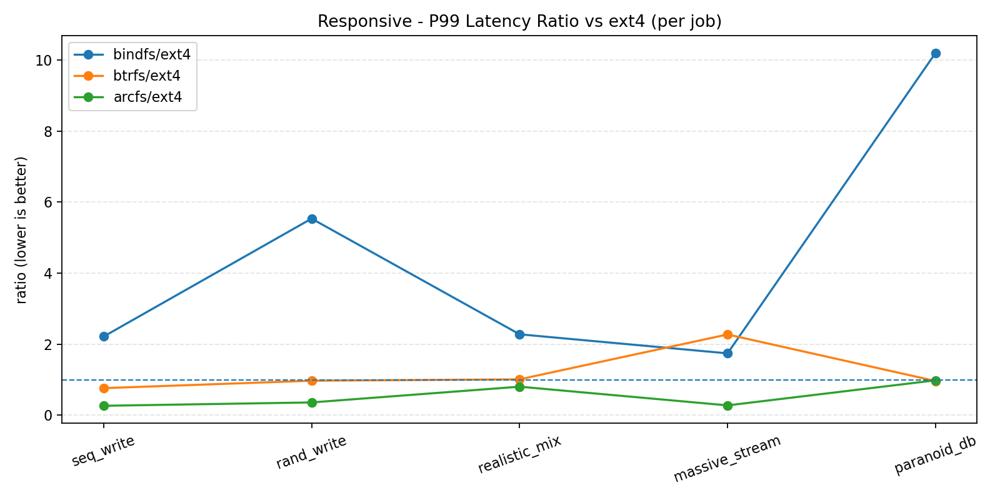
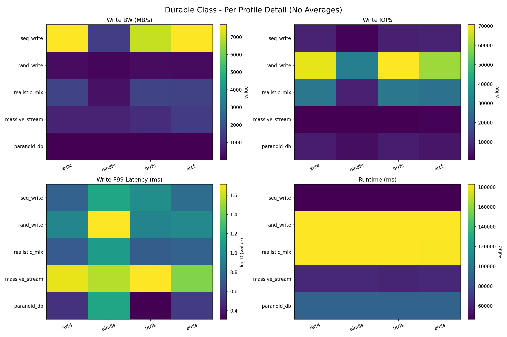
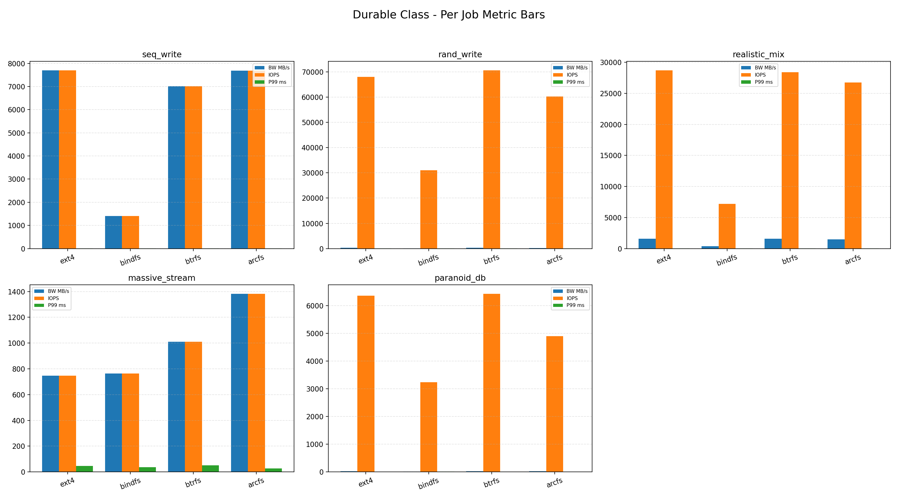
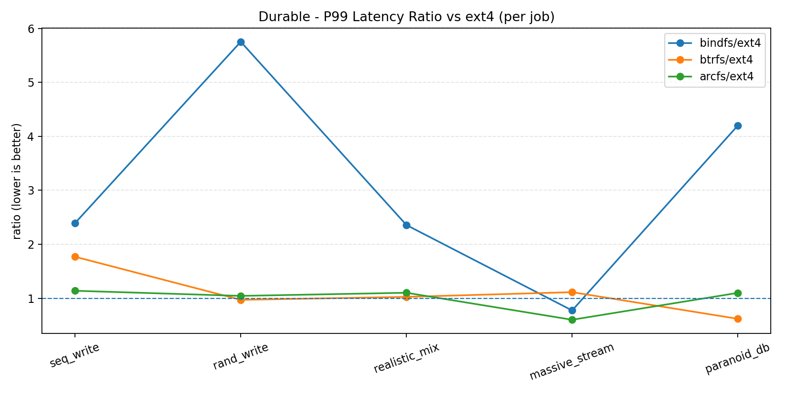
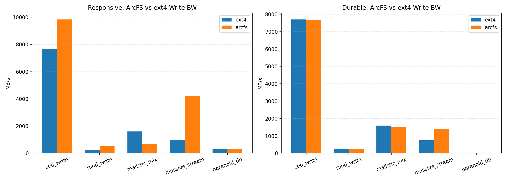
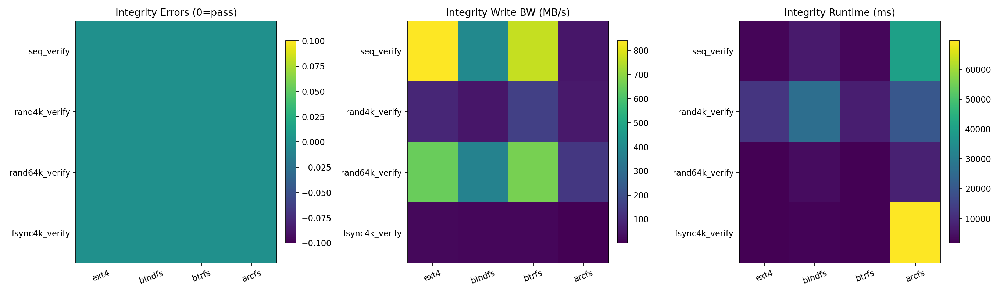

# ArcFS Benchmark Report (Final)

## 1. Scope

This report summarizes the final benchmark campaign across:
- `ext4` (kernel baseline)
- `btrfs` (kernel CoW baseline)
- `bindfs` (FUSE pass-through baseline)
- `arcfs` (ArcFS)

The suite is split into three result classes:
- **Responsive class**: acceptance-path performance under realistic asynchronous operation.
- **Durable class**: persistence-focused performance with explicit sync barriers.
- **Integrity class**: correctness-only verification profiles using deterministic `verify=crc32c` jobs.

---

## 2. Final Visualizations

### 2.1 Responsive Class (Per-profile Detail)

### 2.2 Durable Class (Per-profile Detail)

### 2.3 ArcFS vs ext4 by Class

### 2.4 Integrity Suite Summary

---

## 3. Results Interpretation

### 3.1 Responsive Class
- ArcFS is strongest on high-ingest write paths (`seq_write`, `massive_stream`) because write-back buffering and coalescing reduce immediate media penalties.
- ArcFS remains competitive on random and mixed traffic, but not uniformly dominant in every mixed workload.
- `bindfs` consistently trails kernel filesystems on bandwidth and latency tails, which correctly reflects FUSE pass-through overhead without storage-engine optimization.

### 3.2 Durable Class
- As expected, ArcFS advantage narrows when durability is enforced (`end_fsync` / `fsync` semantics).
- ArcFS stays close to kernel filesystems on most durable profiles, but strict sync pressure reduces its acceptance-path advantage.
- This confirms the suite is now measuring true persistence behavior rather than only buffered acceptance speed.

### 3.3 Integrity Class
- All integrity profiles passed (error code `0`) for all targets, including ArcFS.
- ArcFS shows notably higher runtime in `fsync4k_verify`, which is consistent with user-space flush/commit costs under frequent sync points.
- Integrity and performance are now cleanly separated, so correctness checks no longer destabilize mixed performance profiles.

---

## 4. Why This Suite Is Fairer Than Before

1. **Two-class performance matrix** prevents mixing acceptance-path and durability-path conclusions.
2. **Dedicated integrity suite** avoids false verify failures on mixed random overwrite workloads.
3. **Consistent fio controls** across targets (`io_uring`, `direct=1`, fixed seeds, explicit depth/jobs, time-based runs).
4. **Validation scripts** now check per-class outputs and highlight fairness issues like shallow effective depth.

---

## 5. Practical Conclusion

- ArcFS is validated as a strong write-optimized FUSE filesystem in responsive scenarios.
- Under durability pressure, ArcFS remains competitive but behaves closer to kernel filesystems (as expected).
- Integrity is confirmed across all targets with deterministic verification jobs.

The benchmark suite is now suitable for publishing comparative claims without conflating responsiveness, durability, and correctness.
